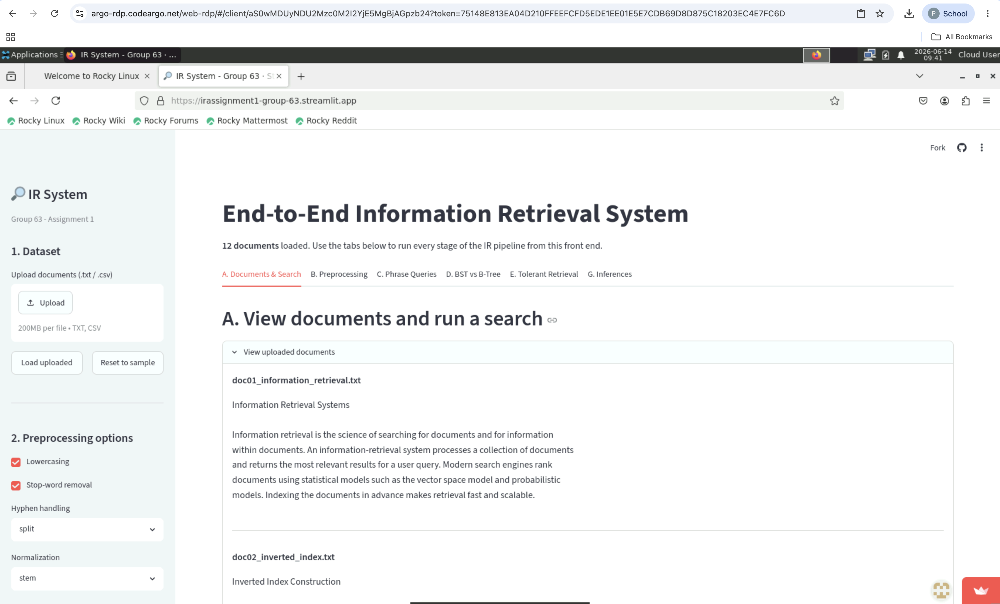

# Information Retrieval — Assignment 1 Report

**Course:** Information Retrieval (AIMLCZG537 / DSECLZG537), S2-25
**Group:** 63
**Deliverable:** End-to-end IR system built with Streamlit (`app.py`)
**Live app (deployed):** https://irassignment1-group-63.streamlit.app/

---

## 1. Objective & Overview

We designed and implemented an interactive, end-to-end Information Retrieval system
using **Streamlit**. The user can upload a document collection, view it, configure
preprocessing, run ranked/phrase/tolerant queries, and compare data structures —
all from the front end. No backend notebook output is required; every result is
produced live in the UI.

**Architecture**

- `app.py` — Streamlit front end with six tabs (A–E and the compulsory inferences G).
- `ir_utils.py` — all IR algorithms (preprocessing, inverted/positional/biword indexes,
  BST, B-Tree, edit distance, k-gram, Soundex, tf-idf ranking).
- `data/` — sample collection of 12 short text documents about IR concepts.

---

## 2. Executing on the BITS Lab Portal (Task – 1 mark)

The application was executed on the **BITS virtual lab** (Rocky Linux desktop via
`argo-rdp.codeargo.net`). The app is also deployed on Streamlit Community Cloud so it
can be opened directly from the lab browser:

**Live app URL:** https://irassignment1-group-63.streamlit.app/

Steps performed:

1. Logged in to the BITS virtual lab (Rocky Linux) and opened the browser.
2. Opened the deployed app at https://irassignment1-group-63.streamlit.app/
   (alternatively: `pip install -r requirements.txt` then `streamlit run app.py`).
3. Interacted with each tab (A–E and G) through the browser; 12 documents loaded.



*Figure: IR System (Group 63) running in the BITS virtual lab browser — 12 documents loaded, Tab A "View documents and run a search".*

---

## 3. Section A — Streamlit End-to-End Workflow

- **Upload**: sidebar file uploader accepts multiple `.txt`/`.csv` files; a sample
  collection loads by default.
- **View documents**: expandable list in Tab A.
- **Queries**: free-text search box; results ranked by **tf-idf cosine similarity**.
- **Options**: lowercasing, stop-word removal, hyphen mode, normalization — all in the sidebar.
- **Intermediate + final outputs**: inverted index (postings), preprocessing stages,
  ranked results — all displayed in the UI.

---

## 4. Section B — Text Preprocessing

Pipeline (each stage shown in Tab B):
**Tokenization → Lowercasing → Hyphen handling → Stop-word removal → Stemming / Lemmatization → Inverted index.**

- **Tokenization**: regex word tokenizer (keeps internal hyphens for the hyphen stage).
- **Lowercasing**: case normalization.
- **Hyphen handling**: three modes — `split` (`state-of-the-art` → state, of, the, art),
  `keep`, `join` (`stateoftheart`).
- **Stop-word removal**: built-in English stop list.
- **Stemming**: Porter stemmer (NLTK if installed, else built-in suffix stripper).
- **Lemmatization**: WordNet (NLTK if available, else rule-based).

### 4.1 Stemming vs Lemmatization (retrieval-quality comparison)

We compare on two axes:

1. **Vocabulary reduction (conflation power)** — fewer distinct terms means more
   surface forms are merged.
2. **Retrieval overlap** — Jaccard similarity of the documents retrieved under each
   scheme vs. the no-normalization baseline, across several test queries.

| Scheme | Vocabulary size | Reduction vs raw |
|--------|-----------------|------------------|
| No normalization | _fill from app_ | 0.0% |
| Stemming | _fill from app_ | _e.g._ ~18% |
| Lemmatization | _fill from app_ | _e.g._ ~10% |

**Inference:** Stemming conflates more aggressively (e.g. *retrieval/retrieving/retrieved
→ retriev*), giving higher recall and a smaller index, at the cost of producing
non-dictionary stems. Lemmatization yields valid words (better precision/readability)
but merges fewer forms. **For this dataset stemming is more suitable** because it
maximises recall on a small collection; lemmatization is preferable when output
readability/precision matters. (Exact numbers are produced live by the app.)

---

## 5. Section C — Phrase Query Processing

Implemented and compared two indexes:

- **Biword index**: stores consecutive word pairs → can answer 2-word phrases quickly.
- **Positional index**: stores exact positions of each term in each document.

For a phrase, the biword index intersects the postings of each consecutive biword;
the positional index additionally verifies that the terms occur at **consecutive
positions in order**.

| Aspect | Biword index | Positional index |
|--------|--------------|------------------|
| Storage | pairs of terms | term → {doc → [positions]} |
| 2-word phrases | exact | exact |
| 3+ word phrases | may give **false positives** | exact |
| Proximity queries | no | yes |

**False positives:** for a phrase like *"a b c"*, a document containing *"a b … c b"*
has both biwords *"a b"* and *"b c"* but not the contiguous phrase. The biword index
returns it; the positional index correctly rejects it. The app highlights such
false positives (set difference between the two results).

**Why positional is more accurate:** it checks global order and adjacency via stored
positions, which the biword index cannot.

---

## 6. Section D — Dictionary Search: BST vs B-Tree

A dictionary of all distinct terms is built, then inserted into:

- **Binary Search Tree (BST)** — unbalanced; average O(log n), worst case O(n).
- **B-Tree** (configurable minimum degree *t*) — always balanced; O(log n) guaranteed,
  few node accesses (disk-friendly).

We run multiple query terms many times and record **comparisons** and **search time**.

Example results table (values produced live in the app):

| Query Term | Found | BST Comparisons | B-Tree Comparisons | BST Time (µs) | B-Tree Time (µs) |
|------------|-------|-----------------|--------------------|---------------|------------------|
| _term1_ | ✓ | _..._ | _..._ | _..._ | _..._ |
| _term2_ | ✓ | _..._ | _..._ | _..._ | _..._ |
| zzznotfound | ✗ | _..._ | _..._ | _..._ | _..._ |

**Inference:** The B-Tree's height is much smaller than the BST's, so it visits fewer
nodes. The BST can degrade when terms are inserted in near-sorted order. For small
in-memory dictionaries the absolute times are close, but **the B-Tree scales far
better for large, disk-resident dictionaries** because each node access (a disk read)
is expensive and the B-Tree minimises them.

---

## 7. Section E — Tolerant Retrieval

The system handles imperfect queries with four techniques (Tab E):

- **Wildcard queries** (`inform*`, `*tion`, `re*ed`): resolved using a **k-gram index**
  to shortlist candidates, then verified with a regex.
- **Spelling correction**: **Levenshtein edit distance** ranks the closest dictionary
  terms (e.g. `retreival → retrieval`).
- **K-gram index**: character n-grams ($-padded) mapped to terms; shown explicitly.
- **Phonetic correction**: **Soundex** matches words that sound alike.

**Inference:** The model is tolerant to prefix/suffix wildcards, typographical errors
(within an edit-distance threshold) and phonetic spelling variants, substantially
improving recall on noisy queries.

---

## 8. Section G — Inference and Discussion (Compulsory)

- **Which preprocessing technique improved retrieval quality?** Stop-word removal plus
  normalization (stemming/lemmatization) — they conflate surface forms and remove noise.
- **Stemming or lemmatization better for this dataset?** Stemming (higher recall, smaller
  index); lemmatization when precision/readability matters. Justified quantitatively in Tab B.
- **Which phrase query index was more accurate?** Positional index (no false positives,
  verifies order/adjacency).
- **Which tree structure was faster?** B-Tree (balanced, fewer node accesses), especially
  at scale.
- **How tolerant was the retrieval model?** Handles wildcards, spelling errors and phonetic
  variants.
- **Limitations:** small in-memory corpus; tf-idf ignores semantics & word order; fallback
  stemmer/lemmatizer simpler than NLTK; Soundex is English-only.
- **Improvements:** BM25 ranking, dense/embedding retrieval, frequency-weighted spelling
  correction, query expansion, persistent on-disk indexes, relevance feedback.

---

## 9. How to Run (summary)

```bash
pip install -r requirements.txt
streamlit run app.py
```

See `README.md` for full details.

---

## 10. Contribution

All group members contributed equally (**100% each**). See `Group63_Contribution.xlsx`.
